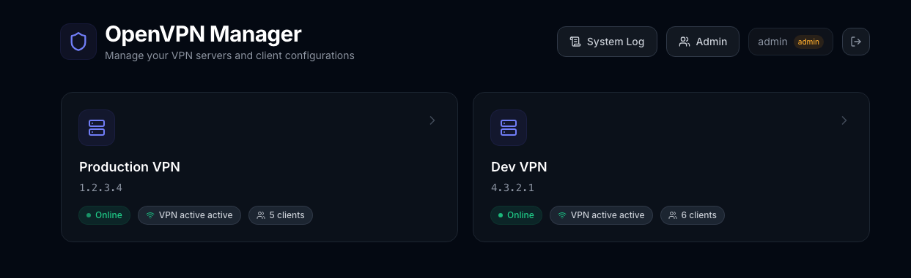
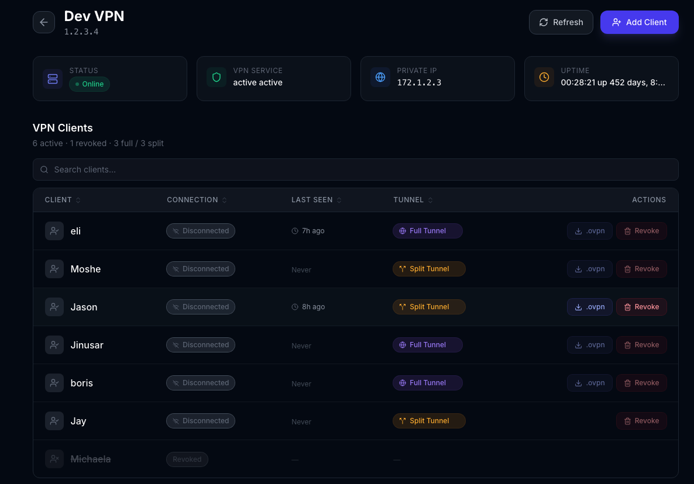

# OpenVPN Manager

A full-stack web application for managing OpenVPN clients across multiple EC2 servers. Automates user creation, revocation, `.ovpn` file downloads, and tunnel mode switching — all from a modern UI with role-based access control.





## Features

- **Multi-server management** — manage clients across multiple OpenVPN servers from a single dashboard
- **Client lifecycle** — create and revoke VPN users via the web UI (no more SSH-ing into servers)
- **Smart username generation** — enter a first name, last name, and email; the VPN username is auto-generated as `<firstname>_<lastname>_<env>` (e.g. `john_doe_prod`)
- **Slack integration** — after creating a client, the `.ovpn` file is automatically sent to the user via Slack DM (looked up by email), including the password if one was set and a link to the setup guide
- **Tunnel mode control** — switch clients between full tunnel and split tunnel on the fly
- **`.ovpn` downloads** — download client config files directly from the browser
- **Connection monitoring** — real-time connected/disconnected status and last-seen timestamps for each client
- **Search & sort** — filter and sort the client table by name, email, connection status, last seen, or tunnel mode
- **System audit log** — tracks all actions (client creation, revocation, downloads, tunnel changes, logins, admin user management) with filterable, paginated log view
- **Authentication** — JWT-based login with admin and viewer roles
- **User management** — admin panel to create, edit, and delete manager users
- **Persistent storage** — SQLite databases (users, audit log, client metadata) stored on a PVC, survives pod restarts and rescheduling
- **Kubernetes-native** — ships with a Helm chart for production deployment on EKS

## Architecture

```
┌─────────────┐       ┌──────────────┐       ┌──────────────────┐
│   Browser    │──────▶│   Frontend   │──────▶│     Backend      │
│              │       │  (React/TS)  │       │   (FastAPI)      │
│              │       │  Nginx :80   │       │   Uvicorn :8000  │
└─────────────┘       └──────────────┘       └────────┬─────────┘
                                                      │ SSH (Paramiko)
                                              ┌───────┴────────┐
                                              │                │
                                         ┌────▼─────┐   ┌─────▼────┐
                                         │ VPN EC2  │   │ VPN EC2  │
                                         │ (Prod)   │   │ (Dev)    │
                                         └──────────┘   └──────────┘
```

| Layer    | Stack                                    |
|----------|------------------------------------------|
| Frontend | React 19, TypeScript, Tailwind CSS, Vite |
| Backend  | Python 3.13, FastAPI, Paramiko, SQLite, Slack SDK |
| Auth     | JWT (python-jose), bcrypt (passlib)       |
| Infra    | Docker, Helm, Kubernetes, Nginx           |

## Project Structure

```
openvpn_manager/
├── backend/
│   ├── app/
│   │   ├── main.py          # FastAPI routes (VPN + auth + admin)
│   │   ├── auth.py          # JWT auth, user CRUD, SQLite storage
│   │   ├── audit.py         # Audit logging + client metadata (SQLite)
│   │   ├── config.py        # Pydantic settings from env vars
│   │   ├── slack_notify.py  # Slack DM with .ovpn file delivery
│   │   └── ssh_manager.py   # SSH automation (create/revoke/tunnel/download)
│   ├── Dockerfile
│   ├── requirements.txt
│   ├── run.py
│   └── .env.example
├── frontend/
│   ├── src/
│   │   ├── auth.tsx          # Auth context & token management
│   │   ├── api.ts            # API client with auth headers
│   │   ├── App.tsx
│   │   └── components/
│   │       ├── LoginPage.tsx
│   │       ├── Dashboard.tsx
│   │       ├── ServerDetail.tsx
│   │       ├── ClientTable.tsx
│   │       ├── CreateClientModal.tsx
│   │       ├── AdminPanel.tsx
│   │       ├── AuditLog.tsx
│   │       └── ...
│   ├── Dockerfile
│   └── nginx.conf.template
├── helm/
│   └── openvpn-manager/
│       ├── Chart.yaml
│       ├── values.yaml
│       └── templates/
│           ├── deployment-backend.yaml
│           ├── deployment-frontend.yaml
│           ├── service-backend.yaml
│           ├── service-frontend.yaml
│           ├── ingress.yaml
│           ├── configmap.yaml
│           ├── secret-admin.yaml
│           ├── secret-ssh-keys.yaml
│           └── pvc.yaml
└── docker-compose.yml
```

## How It Works

This system replaces the manual workflow of SSH-ing into each OpenVPN EC2 server, running an interactive shell script, and copying `.ovpn` files back to your laptop. The backend automates every step over SSH using [Paramiko](https://www.paramiko.org/).

### The Problem

Each OpenVPN server runs the open-source [openvpn-install](https://github.com/angristan/openvpn-install) script. Managing clients requires an operator to:

1. SSH into the EC2 instance
2. Run the interactive setup script (`/vpn/setup_open_vpn.sh`)
3. Navigate a text menu (add user, revoke user, etc.)
4. Type the client name, choose password or passwordless
5. Wait for certificate generation
6. Copy the resulting `.ovpn` file from the server to their machine
7. Send it to the end user

With multiple servers and dozens of users, this becomes tedious and error-prone.

### SSH Automation (Backend)

The backend (`ssh_manager.py`) connects to each VPN server over SSH using a private key and automates the interactive script programmatically:

```
Backend (FastAPI)                          VPN Server (EC2)
      │                                         │
      │─── SSH connect (Paramiko + key) ────────▶│
      │                                         │
      │─── echo -e "1\n{name}\n1" | sudo       │
      │    /vpn/setup_open_vpn.sh ──────────────▶│  ← pipe answers to interactive prompts
      │                                         │
      │◀── stdout: certificate output ──────────│
      │                                         │
      │─── SFTP: download {name}.ovpn ──────────▶│
      │◀── file bytes ──────────────────────────│
      │                                         │
      │─── SSH close ───────────────────────────▶│
```

**Client creation** pipes all expected answers (menu choice, client name, password option) to the script's stdin in a single `echo -e ... | sudo script` command. This avoids fragile interactive prompt matching and handles the script's variable output reliably.

**Client revocation** uses an interactive shell (`invoke_shell`) because the script dynamically lists existing clients with numbered indices. The backend reads the menu, finds the target client's number, and sends it back — then confirms the revocation.

### Data Sources Read via SSH

| Data | Source on Server | Method |
|------|-----------------|--------|
| Client list (active/revoked) | `/etc/openvpn/easy-rsa/pki/index.txt` | Parse PKI index: `V` = valid, `R` = revoked |
| `.ovpn` file availability | `ls ~/*.ovpn` | Check if config file exists |
| Tunnel mode (full/split) | `/etc/openvpn/ccd/<client>` | CCD file with `redirect-gateway` = full tunnel; `.orig` suffix = split |
| Currently connected clients | `/var/log/openvpn/status.log` (or similar) | Parse the `CLIENT LIST` CSV section for common name, IP, connected since |
| Last seen timestamp | `journalctl -u openvpn*` | Grep for `Peer Connection Initiated` events per client |
| Server health | `uptime`, `systemctl is-active openvpn*` | Standard system commands |

### Tunnel Mode Switching

OpenVPN's Client Config Directory (CCD) allows per-client overrides. The backend manages tunnel mode by:

- **Full tunnel**: writes `push "redirect-gateway def1"` to `/etc/openvpn/ccd/<client>`
- **Split tunnel**: renames the CCD file to `<client>.orig`, disabling the override

The client must reconnect for the change to take effect.

### Client Creation & Username Generation

Instead of manually choosing a VPN username, the admin enters the user's **first name**, **last name**, and **email address**. The system automatically generates a VPN username in the format:

```
<firstname>_<lastname>_<env>
```

For example, entering "John", "Doe" on the Production server produces `john_doe_prod`. Names are sanitized (non-alphanumeric characters removed, lowercased) before generation. The email and real name are stored in a `client_metadata` SQLite table and displayed alongside the VPN username in the client table, making it easy to search for users by real name or email.

### Slack Integration

When creating a VPN client, the admin can toggle **"Send .ovpn via Slack"** (enabled by default). When enabled, the backend:

1. Downloads the generated `.ovpn` file from the VPN server via SFTP
2. Looks up the user's Slack account by email using `users.lookupByEmail`
3. Opens a DM channel with `conversations.open`
4. Uploads the `.ovpn` file to the DM using `files_upload_v2` with a message containing:
   - The server name
   - The attached `.ovpn` file
   - The VPN password (if one was set)
   - A link to the Tunnelblink setup guide

Slack integration is **fire-and-forget**: if the lookup fails (user not in workspace, email mismatch, token issue), the VPN client is still created successfully. The UI shows the Slack delivery result after creation. If `SLACK_BOT_TOKEN` is empty or unset, the feature is silently disabled.

**Required Slack bot scopes:** `users:read`, `users:read.email`, `chat:write`, `files:write`, `im:write`

### Audit Log

All significant actions are recorded in an `audit_log` SQLite table with timestamp, username, action type, server, client, and details. Tracked actions include:

- Client creation and revocation
- `.ovpn` file downloads
- Tunnel mode changes
- User logins
- Admin user management (create/update/delete)

Admins can view the full audit log from a dedicated **System Log** tab in the UI, with filtering by action type, text search, and pagination.

### Authentication & Authorization

The management UI itself is protected by JWT authentication. User accounts are stored in a SQLite database on a Kubernetes PersistentVolume. An initial admin account is seeded from a Kubernetes Secret on startup. Admins can create/revoke VPN clients and manage system users; viewers have read-only access.

## Getting Started

### Prerequisites

- Python 3.13+
- Node.js 20+
- SSH key access to your OpenVPN EC2 servers

### Local Development

1. **Configure the backend:**

```bash
cd backend
cp .env.example .env
# Edit .env with your VPN server IPs, SSH key paths, and admin credentials
```

2. **Start the backend:**

```bash
cd backend
python -m venv .venv
source .venv/bin/activate
pip install -r requirements.txt
python run.py
```

3. **Start the frontend:**

```bash
cd frontend
npm install
npm run dev
```

4. Open http://localhost:5173 and log in with the admin credentials from your `.env`.

### Docker Compose

```bash
docker-compose up --build
```

Access at http://localhost:3000.

## Kubernetes Deployment

### Build & Push Images

```bash
# Backend
docker buildx build --platform linux/amd64 --push \
  -t docker.io/kokofish/openvpn-manager-backend:2.0.0 \
  ./backend

# Frontend
docker buildx build --platform linux/amd64 --push \
  -t docker.io/kokofish/openvpn-manager-frontend:2.0.1 \
  ./frontend
```

### Deploy with Helm

1. **Create the namespace:**

```bash
kubectl create namespace vpn-manager
```

2. **Create the SSH keys secret** (if not using `sshKeys` in values):

```bash
kubectl create secret generic vpn-manager-openvpn-manager-ssh-keys \
  -n vpn-manager \
  --from-file=devops-open-vpn-prod.pem=/path/to/prod-key.pem \
  --from-file=devops-open-vpn-stage.pem=/path/to/stage-key.pem
```

3. **Install/upgrade the chart:**

```bash
helm upgrade --install vpn-manager ./helm/openvpn-manager \
  -n vpn-manager \
  --set admin.password=YOUR_SECURE_PASSWORD \
  --set admin.jwtSecret=YOUR_RANDOM_SECRET \
  --set existingSshKeysSecret=vpn-manager-openvpn-manager-ssh-keys
```

### Helm Values Reference

| Key | Description | Default |
|-----|-------------|---------|
| `backend.image.tag` | Backend image tag | `2.0.0` |
| `frontend.image.tag` | Frontend image tag | `2.0.1` |
| `ingress.enabled` | Enable ingress | `true` |
| `ingress.className` | Ingress class | `internal-nginx` |
| `ingress.host` | Ingress hostname | `vpn-manager.<YOUR_DOMAIN>>.com` |
| `admin.username` | Initial admin username | `admin` |
| `admin.password` | Initial admin password | `changeme` |
| `admin.jwtSecret` | JWT signing secret | `change-this-to-a-random-string` |
| `admin.slackBotToken` | Slack bot token for .ovpn DM delivery (empty = disabled) | `""` |
| `persistence.size` | PVC size for user database | `1Gi` |
| `persistence.storageClass` | Storage class | `gp2` |
| `vpnServers.server1.*` | First VPN server config | — |
| `vpnServers.server2.*` | Second VPN server config | — |

## Security Groups

The OpenVPN EC2 servers need the following inbound rule to allow SSH from the Kubernetes cluster:

| Protocol | Port | Source | Description |
|----------|------|--------|-------------|
| TCP | 22 | EKS node subnet CIDR | SSH from VPN Manager backend pods |

## Roles & Permissions

| Action | Admin | Viewer |
|--------|:-----:|:------:|
| View servers & clients | Yes | Yes |
| Download `.ovpn` files | Yes | Yes |
| Create clients | Yes | No |
| Revoke clients | Yes | No |
| Change tunnel mode | Yes | No |
| Manage users | Yes | No |

## API Endpoints

| Method | Path | Auth | Description |
|--------|------|------|-------------|
| `POST` | `/api/auth/login` | — | Login, returns JWT |
| `GET` | `/api/auth/me` | Any | Current user info |
| `GET` | `/api/health` | — | Health check |
| `GET` | `/api/servers` | Any | List VPN servers |
| `GET` | `/api/servers/:id/status` | Any | Server status & uptime |
| `GET` | `/api/servers/:id/clients` | Any | List VPN clients |
| `POST` | `/api/servers/:id/clients` | Admin | Create client |
| `DELETE` | `/api/servers/:id/clients/:name` | Admin | Revoke client |
| `PATCH` | `/api/servers/:id/clients/:name/tunnel` | Admin | Change tunnel mode |
| `GET` | `/api/servers/:id/clients/:name/download` | Any | Download `.ovpn` file |
| `GET` | `/api/admin/users` | Admin | List manager users |
| `POST` | `/api/admin/users` | Admin | Create manager user |
| `PATCH` | `/api/admin/users/:username` | Admin | Update user |
| `DELETE` | `/api/admin/users/:username` | Admin | Delete user |
| `GET` | `/api/admin/audit-log` | Admin | View system audit log |
